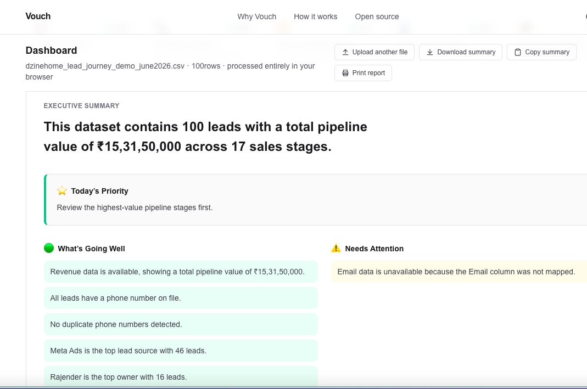
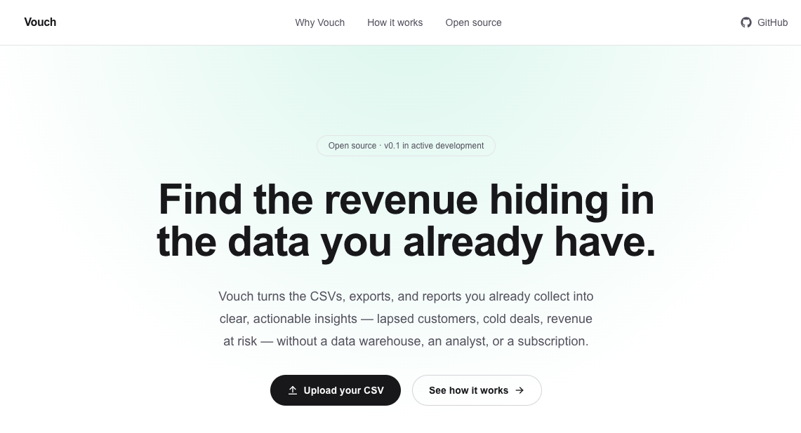
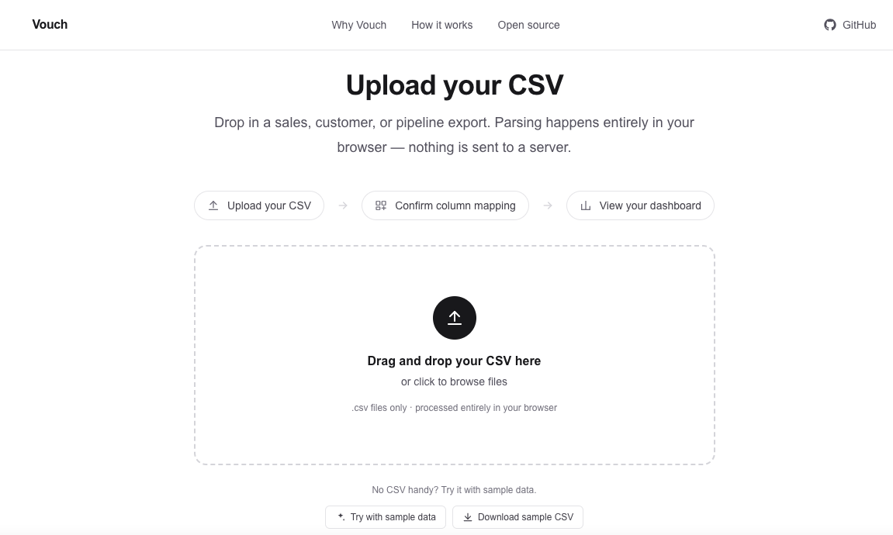
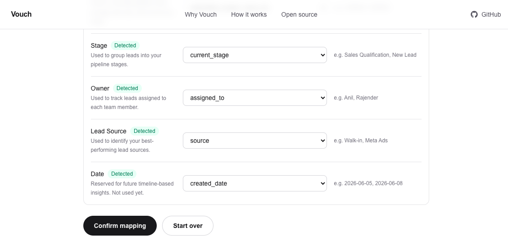
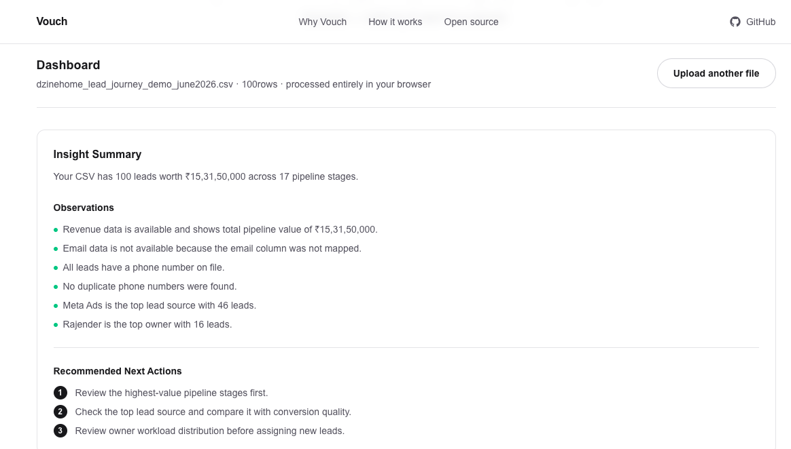
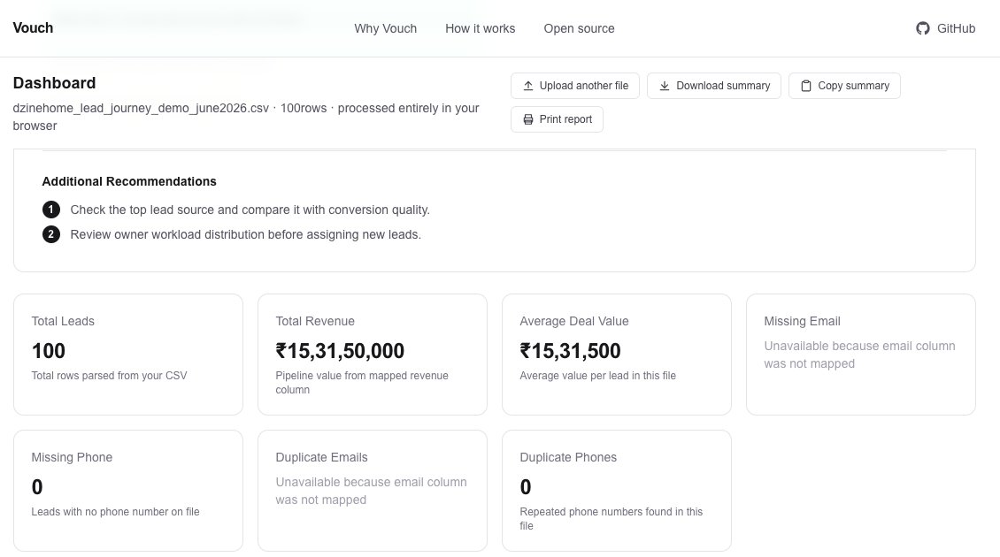
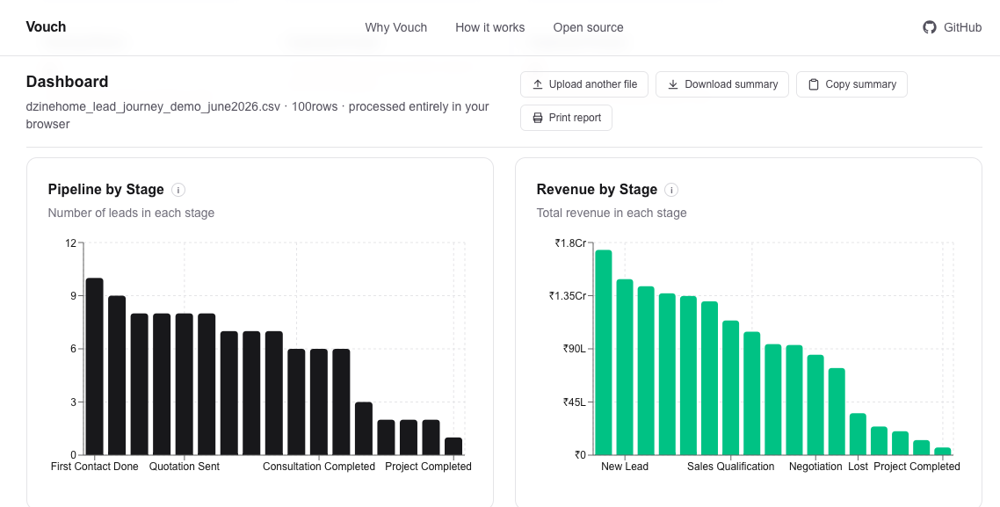
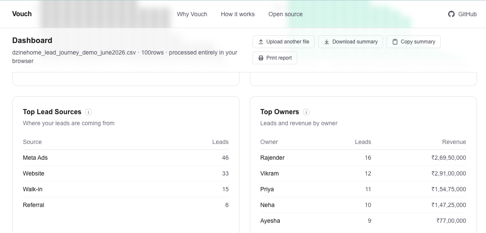

# Vouch Starter Kit

**Find missed revenue opportunities from the data you already have — upload a CSV, get a dashboard in seconds.**

[](LICENSE)
[](CONTRIBUTING.md)
[](https://nextjs.org)
[](https://www.typescriptlang.org)

**Dashboard Overview**



*The full Vouch dashboard — Business Health, Executive Summary, charts, and tables, generated entirely in your browser.*

---

## Quick Start

```bash
git clone https://github.com/yourvouch/vouch-starter-kit.git
cd vouch-starter-kit
npm install
npm run dev
```

Open [http://localhost:3000](http://localhost:3000), go to **Upload your CSV**, and click **Try with sample data** — no file of your own required.

**Requirements:** Node.js 20+ and npm.

---

## What is Vouch?

Vouch is an open-source tool that turns a CSV export — a sales pipeline, a customer list, a leads report — into a clear, actionable dashboard. Drop in a file, confirm how your columns map, and see where money is being left on the table. No data warehouse, no expensive consultants, no lock-in.

### Why Vouch exists

Most businesses are sitting on data that could tell them exactly where they're losing revenue. The problem isn't that the data doesn't exist — it's that making sense of it requires tools that are either too expensive, too complex, or too opaque to trust.

Vouch is built on a simple belief: **insights from your own data should be accessible to everyone**, not just companies with dedicated analytics teams.

### What problem it solves

- You have CSVs, exports, and reports — but no easy way to act on them
- Revenue leaks hide in plain sight: missing contact details, duplicate leads, unassigned owners, stalled pipeline stages
- Existing BI tools are powerful but require setup, training, and ongoing cost
- You want answers in minutes, not dashboards that take weeks to configure

Vouch bridges that gap. Drop in your data, get actionable insights fast — entirely in your browser.

---

## What happens after uploading a CSV?

```
Upload CSV
    │
    ▼
Auto-detect columns
    │
    ▼
Confirm mapping
    │
    ▼
Business Health
    │
    ▼
Executive Summary
    │
    ▼
Charts
    │
    ▼
Recommendations
    │
    ▼
Export / Copy / Print
```

Every step above runs client-side. Your CSV is never uploaded to a server — Vouch parses and analyzes it directly in your browser tab.

---

## Current Features

Everything below exists in the codebase today — nothing here is aspirational.

- **CSV upload** — drag-and-drop or click to browse, parsed entirely client-side with PapaParse (up to 50,000 rows), with live row-count progress on larger files
- **Automatic column detection** for 8 common fields — Name, Email, Phone, Revenue, Stage, Owner, Lead Source, Date — with an editable confirmation screen and a short explanation of what each field is used for
- **Bundled sample dataset** and a **"Try with sample data"** action, so you can explore the full dashboard without a file of your own
- **Business Health strip** — five at-a-glance status cards (Pipeline Value, Contact Quality, Data Completeness, Owner Coverage, Revenue Visibility), each derived from your actual data
- **Executive Summary** — a plain-English summary sentence, "What's Going Well" and "Needs Attention" observations, one prioritized "Today's Priority" action, and additional recommendations — all generated deterministically from your data, with no AI calls
- **Dashboard stat cards** — Total Leads, Total Revenue, Average Deal Value, Missing Email, Missing Phone, Duplicate Emails, Duplicate Phones — each with contextual helper text
- **Charts** — Pipeline by Stage and Revenue by Stage (via Recharts)
- **Tables** — Top Lead Sources and Top Owners
- **India-first currency formatting** — ₹ and Indian digit grouping (e.g. `₹15,31,50,000`), with compact lakh/crore notation on chart axes
- **Export tools** — download the summary as a `.txt` file, copy it to the clipboard, or print a clean, browser-friendly report
- **Clear empty states** — when a column isn't mapped, Vouch says exactly why (e.g. "Email column was not mapped") instead of showing a generic error
- **Landing page** describing the product, with a direct path into the upload flow

What Vouch does **not** do (by design, for now): authentication, a database, payments, AI-generated insights, CRM integrations, or cloud hosting. See [Roadmap](#roadmap).

---

## Screenshots

### 2. Landing Page



*The Vouch landing page, describing the product and linking into the upload flow.*

### 3. Upload CSV



*Drag-and-drop CSV upload, parsed entirely client-side.*

### 4. Column Mapping



*Confirming and adjusting auto-detected column mappings before continuing.*

### 5. Executive Summary



*The Business Health strip and plain-English Executive Summary.*

### 6. Dashboard Metrics



*Stat cards for leads, revenue, and data quality.*

### 7. Pipeline Insights



*Pipeline by Stage and Revenue by Stage charts.*

### 8. Lead Sources & Owners



*Top Lead Sources and Top Owners tables.*

---

## Sample datasets

Vouch includes a bundled sample dataset (`lib/sampleData.ts`) — 30 rows of realistic CRM-style data with a few intentional data-quality issues (missing emails and phone numbers, a duplicate contact, an unassigned lead), so the dashboard has something meaningful to show right away.

On the upload page, click **"Try with sample data"** to load it directly, or **"Download sample CSV"** to save it and upload it yourself.

---

## Tech Stack

- [Next.js 16](https://nextjs.org) (App Router, Turbopack)
- [React 19](https://react.dev)
- [TypeScript](https://www.typescriptlang.org) (strict mode)
- [Tailwind CSS v4](https://tailwindcss.com)
- [Recharts](https://recharts.org) for charts
- [PapaParse](https://www.papaparse.com) for client-side CSV parsing
- [Vitest](https://vitest.dev) for unit tests
- [ESLint](https://eslint.org) for linting

No backend, no database, no external API calls.

---

## Project Structure

```
vouch-starter-kit/
├── app/                  Next.js App Router pages (landing page, /upload)
├── components/
│   ├── dashboard/        Dashboard UI — stat cards, charts, tables, Executive Summary
│   ├── upload/           Upload flow UI — dropzone, column mapping, onboarding
│   └── ui/               Small reusable primitives (buttons, tooltips, containers)
├── lib/
│   ├── insights/         Pure functions that compute dashboard metrics and summaries
│   ├── upload/           CSV parsing, column detection, and shared upload types
│   └── sampleData.ts     Bundled demo dataset used by "Try with sample data"
├── public/               Static assets
└── docs/                 Documentation assets (e.g. screenshots)
```

---

## Roadmap

See [ROADMAP.md](ROADMAP.md) for the full vision and milestone details.

| Version | Status | Highlights |
|---------|--------|------------|
| v0.1 | **Community Preview** | CSV upload, column mapping, dashboard, Business Health, Executive Summary, export tools |
| v0.2 | Planned | Deeper insight types (lapsed customers, conversion bottlenecks), saved sessions |
| v1.0 | Community Edition Vision | Stable API, self-hosted deployment guide, plugin system |

---

## Who is this for?

- **Small business owners** who want to understand their sales data without hiring analysts
- **Operators and revenue teams** looking for quick wins in their existing reports
- **Developers** who want to build on a solid open-source foundation
- **Consultants** who want a tool they can customize and self-host for clients

---

## Community Edition philosophy

Vouch Starter Kit is, and will remain, free and open source under the MIT license. It's built to be:

- **Simple first** — works from a single file upload, no infrastructure required
- **Transparent** — every number on the dashboard traces back to a plain function you can read
- **Trustworthy** — your data stays in your browser; nothing is sent anywhere without your consent
- **Focused** — does one thing well: finds what deserves your attention in the data you already have

---

## Contributing

Vouch is built in the open and welcomes contributions of all kinds — code, documentation, design, testing, and ideas.

Read [CONTRIBUTING.md](CONTRIBUTING.md) to get started, and [PRODUCT-SPEC.md](PRODUCT-SPEC.md) to understand the full product vision.

---

## Community

- **Issues & discussions** — use [GitHub Issues](../../issues) for bugs, questions, and feature requests
- **Code of Conduct** — see [CODE_OF_CONDUCT.md](CODE_OF_CONDUCT.md)
- **Security** — see [SECURITY.md](SECURITY.md) for responsible disclosure
- **Changelog** — see [CHANGELOG.md](CHANGELOG.md) for what's shipped so far

---

## License

MIT © [Vouch](LICENSE)
