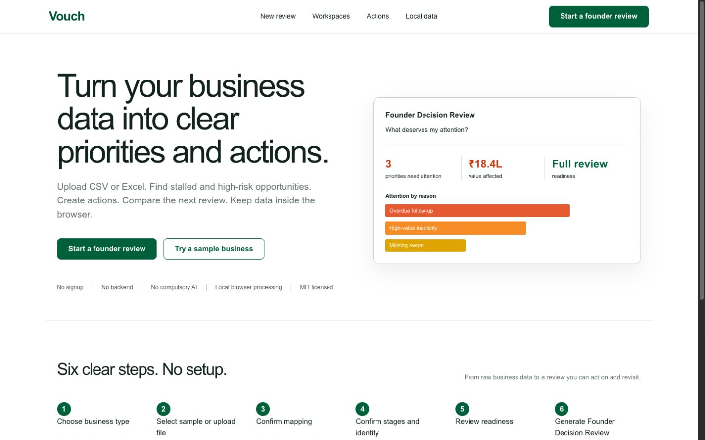
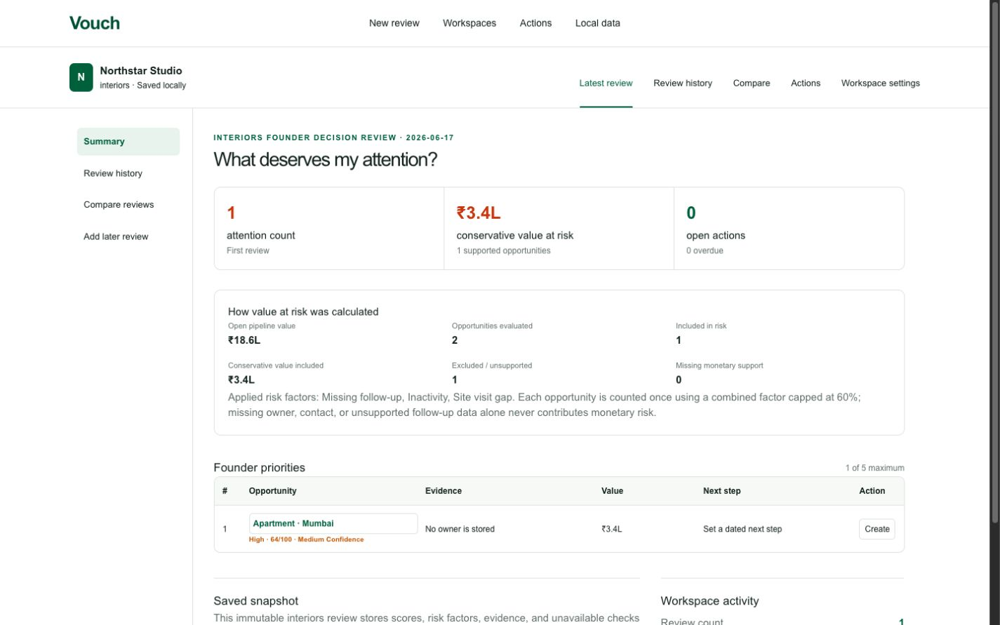
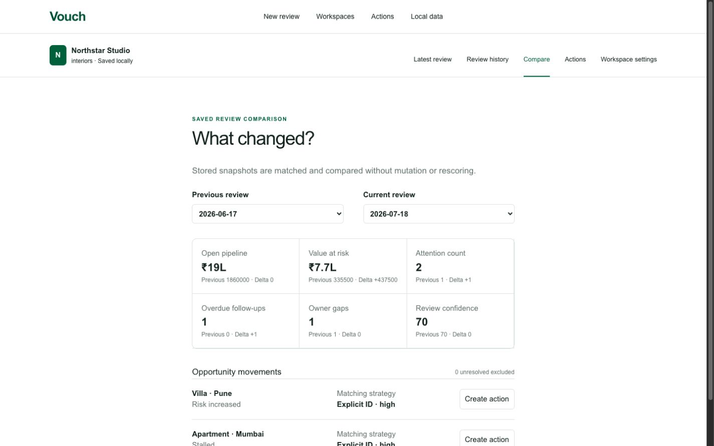
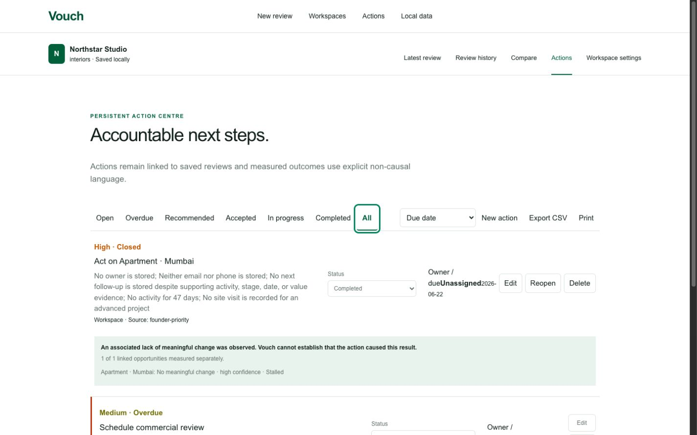

# Vouch Starter Kit 2.0

**An open-source, privacy-first Founder Decision Review.**

Upload CSV or Excel data. Understand what deserves attention. Create actions. Save the review. Compare the next review. Observe what changed.

> **Status:** Vouch Starter Kit 2.0 Preview — available for external review, not yet described as a final stable release.

[](https://silly-selkie-ec5eda.netlify.app/)
[](https://yourvouch.com/)
[](https://demo.yourvouch.com/)
[](https://github.com/yourvouch/vouch-starter-kit/issues)
[](LICENSE)

| Destination | Role |
|---|---|
| [Live Starter Kit](https://silly-selkie-ec5eda.netlify.app/) | Hosted preview of this open-source repository |
| [yourvouch.com](https://yourvouch.com/) | Website for the commercial Vouch product |
| [demo.yourvouch.com](https://demo.yourvouch.com/) | Richer demonstration of the full product experience |
| [GitHub Issues](https://github.com/yourvouch/vouch-starter-kit/issues) | Bugs, questions, and feature requests for the Starter Kit |

The Netlify preview is the hosted Starter Kit, not the main commercial Vouch website.



*The open-source Starter Kit begins with a local, no-signup path from business data to priorities and actions.*

## What this repository is

This repository contains the open-source **Vouch Starter Kit**. It is separate from the fuller commercial Vouch product experience presented on [yourvouch.com](https://yourvouch.com/) and [demo.yourvouch.com](https://demo.yourvouch.com/).

The Starter Kit runs in a modern browser. Uploaded CSV and XLSX files are processed locally: no signup, backend, compulsory AI, or cloud data upload is required. Its deterministic rules are readable, testable, and do not require an AI API.

## Product loop

```text
Choose business type
→ Upload CSV/XLSX or try a sample
→ Confirm mapping
→ Confirm stages and identity
→ Generate Founder Decision Review
→ Save workspace
→ Create actions
→ Add a later review
→ Compare changes
→ Observe outcomes
```

Every screen is designed to answer one question: **What deserves my attention?**

## Current capabilities

### Four vertical packs

- General sales
- Interior design and architecture
- Agency and consulting
- SaaS

Each pack provides its own fields, samples, stage semantics, and deterministic intelligence rules.

### Import and review

- Local CSV and modern XLSX import
- Pack-aware automatic mapping and editable field mapping
- Required, recommended, and optional field readiness
- Explicit stage semantics and opportunity identity strategies
- Explainable deterministic attention scoring with evidence and confidence
- Founder Decision Review with priorities and recommended next steps
- Conservative, explainable value-at-risk calculations

### Persistent workspaces and comparison

- IndexedDB workspaces stored in the current browser profile
- Immutable saved review snapshots and dated review history
- Previous-versus-current comparison with matching strategy and confidence
- Progressed, regressed, stalled, won, lost, reopened, new, and removed movements
- Aggregate metric and risk movement, with unresolved matches excluded visibly

### Actions, outcomes, and portability

- Persistent Action Centre with linked and manual actions
- Action lifecycle, owners, due dates, filters, sorting, carry-forward, and duplicate prevention
- Measured outcomes from later saved reviews, retaining previous/current evidence and matching confidence
- Versioned JSON backup, import preview, merge, and confirmed replace
- Action Centre CSV export and print-friendly reviews
- Responsive desktop and mobile layouts

## Founder Decision Review



*A saved, immutable review shows priorities, supporting evidence, confidence, and the calculation behind value at risk.*

## Review comparison



*Eligible snapshots are matched without mutation or rescoring, with previous/current metrics, risk movement, and opportunity-level changes.*

## Action Centre



*Actions stay linked to their source review and opportunity; later reviews can produce measured outcomes using explicit non-causal language.*

## Privacy and trust

- Uploaded CSV/XLSX binaries are parsed locally and are **not stored**.
- Parsed review data can be stored locally in IndexedDB when a review is saved.
- Saved workspaces remain in that browser profile; there are no accounts or cloud sync.
- Users can export a versioned JSON backup, import data, delete a workspace, or clear all local data.
- Credentials, tokens, secrets, and uploaded source files are not included in backups.
- Deterministic outputs do not require an AI API.
- Vouch reports associated outcomes but does not claim that an action caused a result.

## Quick start

Requirements: **Node.js 20+**, npm, and a modern browser with IndexedDB support.

```bash
git clone https://github.com/yourvouch/vouch-starter-kit.git
cd vouch-starter-kit
npm install
npm run dev
```

Open [http://localhost:3000](http://localhost:3000), select a business type, and upload a CSV/XLSX file or use the selected pack's sample.

## Architecture

```text
app/
  page.tsx                         Landing page
  review/                          Six-step review workflow
  workspaces/                      Workspace list and persisted workspace routes
  workspaces/[id]/                 Latest review, history, comparison, actions, settings
  actions/                         Cross-workspace Action Centre
  local-data/                      Backup, import, and clear-local-data tools

components/v2/
  Landing, ReviewFlow, WorkspaceHome, ReviewHistory,
  CompareReviews, ActionCentre, WorkspaceSettings, and shared navigation

lib/v2/
  domain.ts                        Core types and immutable snapshot model
  packs.ts                         Vertical fields, stages, samples, and rules
  mapping.ts                       Detection, editable mapping, and readiness
  intelligence.ts                 Explainable scoring and value-at-risk logic
  comparison.ts                   Eligibility, matching, movements, and deltas
  actions.ts                      Actions, transitions, outcomes, and exports
  storage.ts                      Versioned IndexedDB persistence and backups
  reviews.ts                      Normalized saved-review construction
  xlsx.ts                         Dependency-free ZIP/XML XLSX parser
  *.test.ts                       Deterministic Vitest coverage
```

The application uses Next.js App Router, React, TypeScript, and browser-native IndexedDB. CSV parsing uses PapaParse; the XLSX reader is implemented locally without an Excel parsing dependency.

## Development

```bash
npm test
npm run lint
npx tsc --noEmit
npm run build
```

Tests cover the domain model, vertical packs, mapping, XLSX safety, IndexedDB CRUD and migrations, immutable snapshots, comparisons, actions, measured outcomes, backup/import, exports, and persistent workflows.

## Current limitations

- No accounts
- No cloud sync
- No CRM write-back
- No email notifications
- No billing
- Local data is specific to a browser profile and origin
- JSON export/import is required to move workspaces between browsers
- Output quality and available insights depend on the quality and mapping of source data

## Contributing and support

Contributions are welcome. Read [CONTRIBUTING.md](CONTRIBUTING.md), follow the [Code of Conduct](CODE_OF_CONDUCT.md), report security issues as described in [SECURITY.md](SECURITY.md), and use [GitHub Issues](https://github.com/yourvouch/vouch-starter-kit/issues) for product feedback.

## License

MIT © [Vouch](LICENSE)
